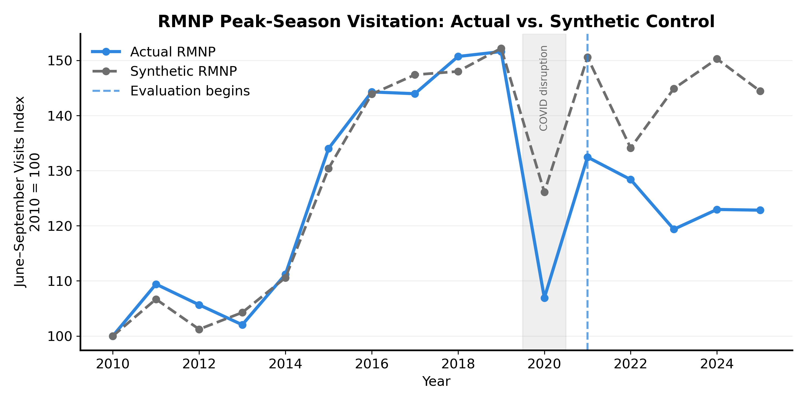

## Did Timed Entry Reduce Crowding at Rocky Mountain National Park?

National Parks across the United States have experienced record visitation growth, creating challenges around traffic congestion, parking availability, trail crowding, and visitor experience. In response, several parks have implemented reservation-based access systems.

This project evaluates whether Rocky Mountain National Park’s timed-entry reservation system reduced visitor crowding using a **synthetic control causal inference** approach.

Instead of comparing visitation before and after implementation, I estimate a counterfactual.

> What would RMNP visitation have looked like if timed entry had never been introduced?

A synthetic version of RMNP was constructed using a weighted combination of comparable National Parks that did not implement major access restrictions.

--- 
### Methods: 
**Data**
- National Park Service monthly recreation visitation data
- Training: 2010–2019
- Evaluation: 2021–2025
- 2020 excluded due to COVID-related disruptions

**Modeling approach**
- Synthetic control causal inference
- Donor pool optimization
- Placebo testing
- Sensitivity analysis
  
--- 
### Key Findings: 
- **Peak-season visitation was 13.4% lower** than the synthetic counterfactual after timed entry implementation.
- Annual visitation decreased by **16.6%**, suggesting reduced demand rather than seasonal redistribution.
- Peak-season concentration did not decrease, indicating remaining visitation was still concentrated during summer months.

---
### Main Results 

A synthetic RMNP was created using comparable National Parks without major reservation systems.



| Metric | Result |
|---|---:|
| Average peak-season effect | -19.7 index points |
| Percent change vs synthetic RMNP | -13.4% |
| Pre-treatment RMSE | 2.55 |

After timed entry implementation, actual RMNP visitation fell below its synthetic counterfactual, suggesting lower-than-expected visitation compared with similar parks.

---

### Robustness checks
To evaluate whether the estimated effect was robust, I performed several validation tests:

| Test | Result |
|---|---:|
| Pre-treatment RMSE | 2.55 |
| Post/pre gap ratio | 9.6 |
| Directional placebo p-value | 0.107 |
| Donor pool sensitivity | Stable |
| Time-window sensitivity | Stable |

The synthetic control closely matched RMNP before timed entry, and results were consistent across alternative modeling assumptions.

---
### Policy Findings

The results suggest that timed entry was associated with a meaningful reduction in RMNP visitation relative to expected trends. However, the mechanism appears to be reduced visitor volume rather than redistribution.

While peak-season visitation declined by 13.4%, annual visitation declined by a similar magnitude and peak-season share increased slightly. This suggests that remaining visitor demand continued to concentrate during traditional high-use months.

For park managers, timed entry may help reduce absolute visitor pressure, but additional strategies may be needed to encourage visitation outside peak periods.

--- 

## Interactive Dashboard

Explore the Streamlit dashboard:

[Launch Dashboard](https://nps-timed-entry-causal.streamlit.app/)

--- 

### Project Structure

```text
nps-timed-entry-causal/
├── app.py 
├── data/
│   ├── raw/
│   │   ├── Main_Data.xls
|   |   └── national_parks_lookup.csv
│   └── processed/
│       ├── monthly_visitation.csv
|       ├── park_intervention_flags.csv
│       ├── donor_pool.csv
|       ├── placebo_results.csv
│       ├── synthetic_results.csv
│       └── synthetic_weights.csv
│
├── figures/
│   ├── actual_vs_synth_peak_season.png
│   ├── effect_time_peak_season.png
|   ├── synthetic_rmnp_donor_comp.png
│   └── rmnp_vs_donorpool.png
│
├── notebooks/
│   ├── 01_data_collection.ipynb
│   ├── 02_intervention_database.ipynb
│   ├── 03_donor_selection.ipynb
│   ├── 04_exploratory_analysis.ipynb
│   ├── 05_synthetic_control.ipynb
│   ├── 06_model_validation.ipynb
│   └── 07_results_and_insights.ipynb
│
└── README.md
```
